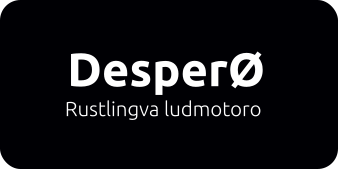

# Despero

Rustlingva ludmotoro, uzata API Vulkan kaj realigata koncepton de EKS (ento-komponanto-sistemo)

# Tasklisto

- [ ] Change backend implementation: set `Renderer` as universal parameter
- [x] `Prelude`
- [ ] Reorganize `InstanceData` (Material) and `VertexData` (Mesh)
- [ ] Resource processing (as hecs ECS)
	- [ ] `Texture`
	- [ ] `Material`
	- [ ] `Mesh`
- [ ] Warmy rudimental feature
- [ ] ECS
	- [ ] `Light`
	- [ ] `ModelBundle`
	- [x] `Camera`
- [ ] Loading models
- [ ] `RenderTexture`
- [ ] Realistic lights
- [ ] Shadows
	- [ ] Simple
	- [ ] Soft
- [ ] UI (egui)
- [ ] Physics (rapier3d)
- [ ] Scripting (mlua)
	- [ ] Simple scripts
	- [ ] Script as resource
- [ ] GLTF Scenes
	- [ ] Processing
	- [ ] GLTFExtras custom parameters
	- [ ] Animation
- [ ] Particle Systems
- [ ] Game Settings
- [ ] Conditional systems
